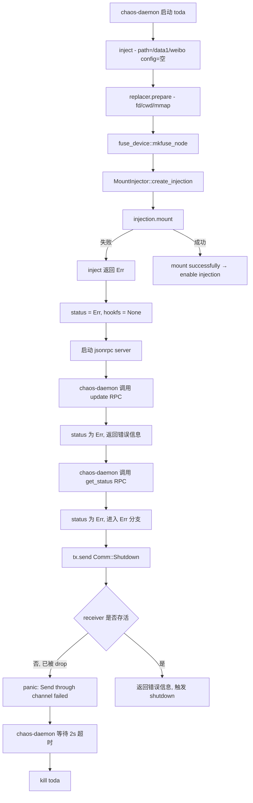

# Toda 文件 IO 注入失败分析报告

## 一、问题现象

chaos-daemon 调用 toda 对容器 `devops/hello-weibo-web-sandbox-hj4-7b9c9b85f8-6zbcq` 的 `/data1/weibo` 路径进行 IO 混沌注入，toda 启动后约 2 秒内 panic 退出，chaos-daemon 报超时并 kill 进程。

关键日志时间线：
```
07:48:16.359  toda 启动，开始 inject
07:48:16.360  ptrace detach 完成（mmap replacer 阶段）
07:48:16.361  "waiting for signal to exit"   ← inject() 已返回
07:48:16.362  jsonrpc server 启动
07:48:16.363  rpc update called → rpc get_status called
              thread panicked at 'Send through channel failed', src/jsonrpc.rs:74:22
07:48:18.356  chaos-daemon 超时（2s），kill toda
```

## 二、根因分析

### Bug 1（直接导致 panic）：channel 接收端被立即丢弃

在 [`main.rs`](src/main.rs:182) 中：

```rust
let (tx, _) = mpsc::channel();
```

`_` 绑定导致 channel 的接收端（receiver）在创建后**立即被 drop**。`tx`（发送端）被传入 jsonrpc 的 `RpcImpl`。

当 chaos-daemon 调用 `get_status` RPC 时，[`jsonrpc.rs`](src/jsonrpc.rs:67:78) 中的处理逻辑为：

```rust
fn get_status(&self, _inst: String) -> Result<String> {
    match &*self.status.lock().unwrap() {
        Ok(_) => Ok("ok".to_string()),
        Err(e) => {
            let tx = &self.tx.lock().unwrap();
            tx.send(Comm::Shutdown)
                .expect("Send through channel failed");  // ← 第74行，panic 发生处
            Ok(e.to_string())
        }
    }
}
```

由于 `status` 为 `Err`（inject 失败），代码进入 `Err(e)` 分支，执行 `tx.send(Comm::Shutdown)`。但接收端已被 drop，`send` 返回 `SendError`，`.expect()` 直接 panic。

### Bug 2（根本原因）：inject() 挂载失败

从日志可以确认 `inject()` 返回了 `Err`，依据如下：

1. 日志中**缺少**以下关键信息（这些日志在 inject 成功路径上必须出现）：
   - `"mount successfully"` — [`mount_injector.rs`](src/mount_injector.rs:91)
   - `"mount with flags"` — [`mount_injector.rs`](src/mount_injector.rs:139)
   - `"running fd replacer"` / `"running mmap replacer"` — replacer run 阶段
   - `"replacer detached"` — [`main.rs`](src/main.rs:98)
   - `"enable injection"` — [`main.rs`](src/main.rs:102)

2. `inject()` 返回 `Err` 后，`main.rs` 中 `status` 被设为 `Err`，`hookfs` 为 `None`，但 jsonrpc server 仍被启动。

3. `get_status` 检测到 `Err` 状态，触发 Bug 1 的 panic。

**inject() 失败的可能位置**（按代码执行顺序）：

| 步骤 | 代码位置 | 可能失败原因 |
|------|----------|-------------|
| `fuse_device::mkfuse_node()` | [`fuse_device.rs`](src/fuse_device.rs:4) | 创建 `/dev/fuse` 设备节点失败（但此错误被吞掉，仅 log） |
| `MountsInfo::parse_mounts()` | [`mount.rs`](src/mount.rs:14) | 读取 `/proc/self/mountinfo` 失败 |
| `mounts.non_root()` | [`mount.rs`](src/mount.rs:21) | 路径不在任何挂载点上（不太可能，因为 `/` 总是挂载点） |
| `mounts.move_mount()` | [`mount.rs`](src/mount.rs:33) | `MS_MOVE` 失败：`/data1/weibo` 不是独立的挂载点，无法 move |
| `fuser::mount()` | [`mount_injector.rs`](src/mount_injector.rs:142) | FUSE 挂载失败：缺少 `/dev/fuse`、内核未加载 fuse 模块、权限不足 |

**最可能的原因**：`/data1/weibo` 不是独立的 mount point，导致 `move_mount`（`MS_MOVE`）操作失败。`MS_MOVE` 只能移动挂载点，不能移动普通目录。

### Bug 3（错误信息被吞掉）：panic 阻止了错误上报

由于 panic 发生在 `tx.send().expect()` 处，`get_status` 无法返回 `Ok(e.to_string())`，chaos-daemon 永远收不到 inject 的具体错误信息，只能等待 2 秒超时。

注意：`update` RPC 在 `get_status` 之前被调用，且 `update` 也会返回错误信息（[`jsonrpc.rs`](src/jsonrpc.rs:79:93)），但 chaos-daemon 似乎依赖 `get_status` 来确认状态。

## 三、调用流程图



## 四、修复方案

### 修复 1：修复 channel panic（必须）

**方案 A（推荐）：保留 receiver，实现 shutdown 信号机制**

修改 [`main.rs`](src/main.rs:182) 和信号等待逻辑，使 receiver 保持存活，并在收到 `Comm::Shutdown` 时触发退出：

```rust
// main.rs
let (tx, rx) = mpsc::channel();
// ... 启动 jsonrpc 线程，传入 tx ...

// 替换原有的 wait_for_signal，改为同时监听信号和 shutdown 消息
info!("waiting for signal to exit");
loop {
    // 使用非阻塞方式检查 channel
    match rx.try_recv() {
        Ok(Comm::Shutdown) => {
            info!("received shutdown signal from rpc");
            break;
        }
        Err(mpsc::TryRecvError::Empty) => {}
        Err(mpsc::TryRecvError::Disconnected) => {
            // jsonrpc 线程退出，也退出
            break;
        }
    }
    // 短暂等待信号
    // ... 或使用更优雅的方式如 select/poll ...
}
```

**方案 B（最小改动）：将 `.expect()` 改为优雅处理**

修改 [`jsonrpc.rs`](src/jsonrpc.rs:73:74)，将 panic 改为日志记录：

```rust
fn get_status(&self, _inst: String) -> Result<String> {
    info!("rpc get_status called");
    match &*self.status.lock().unwrap() {
        Ok(_) => Ok("ok".to_string()),
        Err(e) => {
            let tx = &self.tx.lock().unwrap();
            if let Err(_) = tx.send(Comm::Shutdown) {
                tracing::warn!("failed to send shutdown signal, receiver may be dropped");
            }
            Ok(e.to_string())
        }
    }
}
```

> 建议同时采用方案 A 和 B：方案 A 修复 channel 机制使 shutdown 正常工作，方案 B 作为防御性编程防止未来类似问题。

### 修复 2：排查并修复 inject 挂载失败（必须）

修复 1 完成后，`get_status` 能正常返回错误信息，从而看到 inject 的具体失败原因。根据可能的原因：

1. **如果 `/data1/weibo` 不是独立挂载点**：
   - 需要在 chaos-daemon 侧确保目标路径是独立挂载点
   - 或修改 toda 的挂载逻辑，支持对非挂载点目录进行 bind mount 后再 move

2. **如果 `/dev/fuse` 不存在**：
   - 确保容器内能访问 `/dev/fuse` 设备
   - 检查 `fuse_device::mkfuse_node()` 是否成功（当前失败只 log 不返回错误）

3. **如果 FUSE 内核模块未加载**：
   - 在宿主机上执行 `modprobe fuse`

4. **如果权限不足**：
   - 确保容器具有 `SYS_ADMIN` 和 `SYS_PTRACE` capability
   - 确保以 privileged 或合适的 capabilities 运行

### 修复 3：增强错误日志（建议）

在 [`main.rs`](src/main.rs:175) 中，当 `inject()` 失败时，显式记录错误：

```rust
let mount_injector = inject(option.clone(), vec![]);
if let Err(e) = &mount_injector {
    tracing::error!("inject failed: {}", e);
}
```

## 五、实施步骤

1. **修复 jsonrpc.rs 中的 panic** — 将 `.expect()` 改为优雅错误处理
2. **修复 main.rs 中的 channel 机制** — 保留 receiver，实现 shutdown 信号监听
3. **增强 main.rs 错误日志** — inject 失败时记录详细错误
4. **重新部署 toda，观察 inject 的具体错误信息**
5. **根据错误信息修复挂载问题**（可能是路径非挂载点、/dev/fuse 缺失等）
6. **验证完整的 IO 注入流程**
